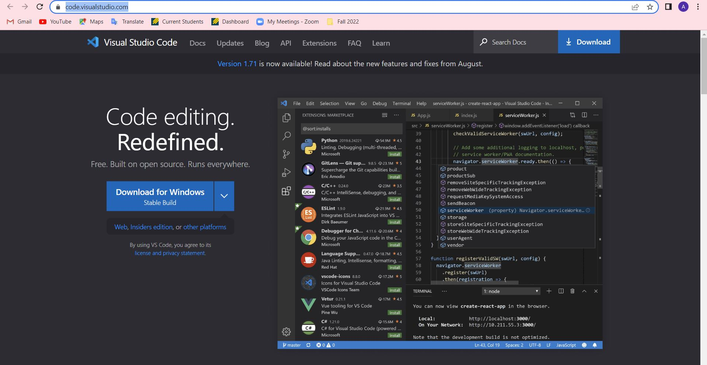
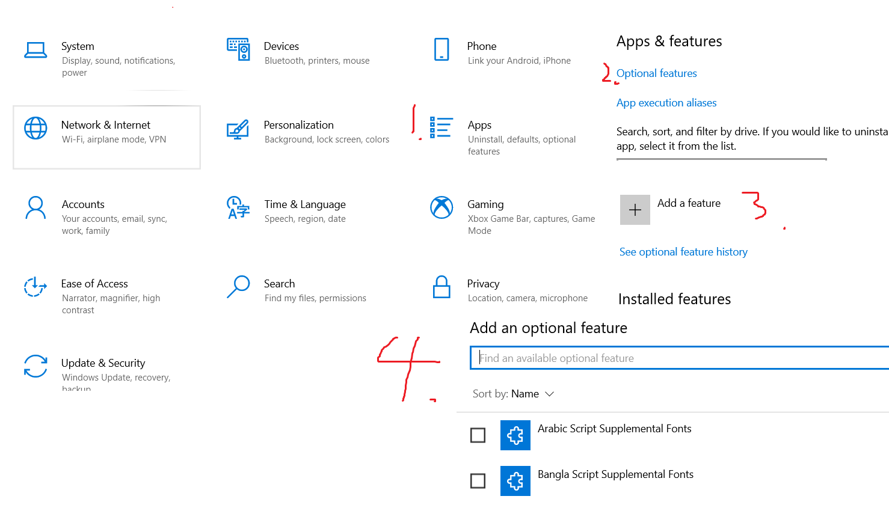
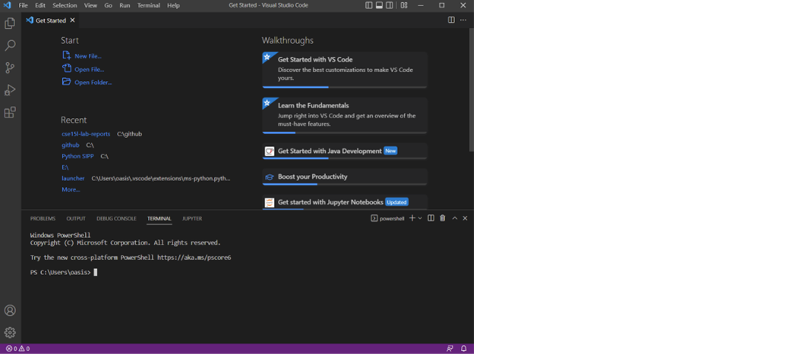
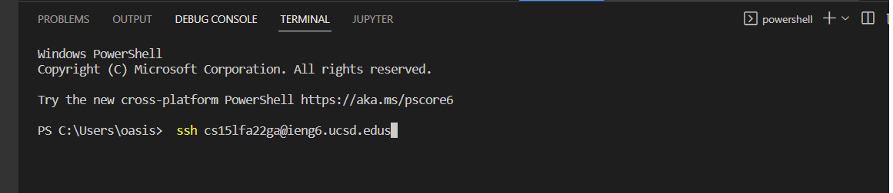
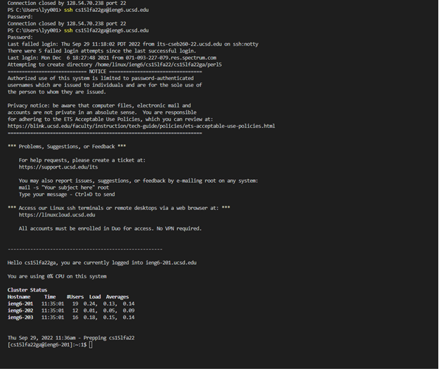
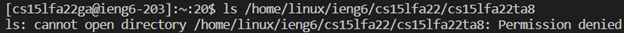
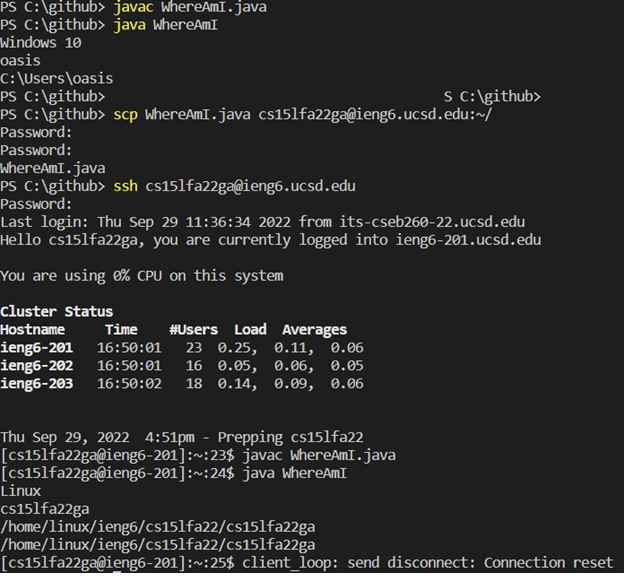
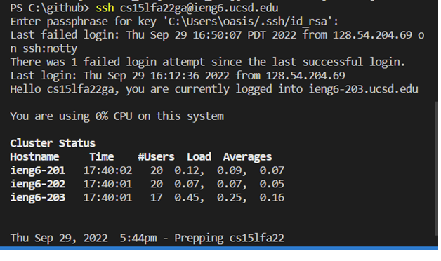

First step:
Installing VScode

* Go to the website: [link] (https://code.visualstudio.com/)
* Personally already have it installed

Second step: Remotely Connecting

* download SHH by in Setting-Apps-Optional Feature; Add a feature and search for “OpenSSH Client”


* Find your account in [link]https://sdacs.ucsd.edu/~icc/index.php
* Open Terminal using Ctrl + ~

* Replace ga with your account
```
$ ssh cs15lfa22ga@ieng6.ucsd.edu
```
* Insert your password 


step three:

* ls show your list of file of the current directory
* pwd show what's your current directory

step four:

* Use Scp to copy your file to server pc when you connect
* remember you are at the right directory of the file you want to copy to

Step five:

* don't put anything for passpharse , just do enter
* remember your are copying public key

Step six:

* run command using " " while accessing server
* You can use ; to seperate the commands and  run two or more command at the same time