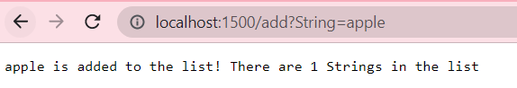
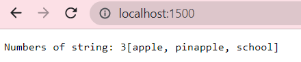
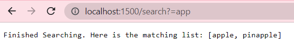
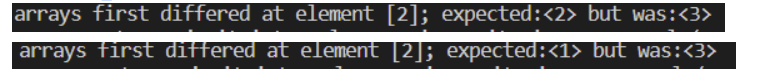
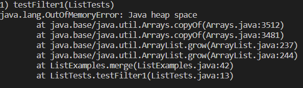

* Part 1

```
import java.io.IOException;
import java.net.URI;
import java.util.ArrayList;
```
```
class Handler implements URLHandler {
    // The one bit of state on the server: a number that will be manipulated by
    // various requests.
    int num = 0;
    ArrayList<String> list = new ArrayList<String>();
    public String handleRequest(URI url) {
        if (url.getPath().equals("/")) {
            //for(int i = 0; i < list.size();) {
                return String.format("Numbers of string: %d" + list.toString(), num);
            //}
            //return String.format("Numbers of string: %d", num);
        } else if (url.getPath().contains("/search")) {
            String[] parameters = url.getQuery().split("=");
            ArrayList<String> matchList = new ArrayList<String>();
            for(int i = 0; i < list.size(); i++) {
                if (list.get(i).contains(parameters[1])) {
                    matchList.add(list.get(i));
                }
            }
            return String.format("Finished Searching. Here is the matching list: " + matchList.toString());
        } else {
            System.out.println("Path: " + url.getPath());
            if (url.getPath().contains("/add")) {
                String[] parameters = url.getQuery().split("=");
                if (parameters[0].equals("String")) {
                    list.add(parameters[1]);
                    num += 1;
                    return String.format("%s is added to the list! There are %d Strings in the list", parameters[1], num);
                }
            }
            return "404 Not Found!";
        }
    }
}
```
```
class SearchEngine {
    public static void main(String[] args) throws IOException {
        if(args.length == 0){
            System.out.println("Missing port number! Try any number between 1024 to 49151");
            return;
        }

        int port = Integer.parseInt(args[0]);

        Server.start(port, new Handler());
    }
}
```


* handler method is being called
* url is the relevent argument that's being pass to the method
* This url trigger adding a new string that's after query and = to the arrarylist (In this case it's apple)

* Handler method is also being called and url is the argument
* This url only equals to "/" so it will print the current String Array list
* This scrreen shot is after adding apple, pinapple and school

* Handler method is also being called and url is the argument
* url got detected including search, then it will create a new Arrary list
* Then run throught the storing array list to find string that contains what after "=" in the query. 

# ReverseInplace bug
* The failure-inducing input is [1,2,3,4]  and [1,2,3] and for reverse in places

```
@Test
  public void testReverseInPlace1() {
    int[] input1 = { };
    ArrayExamples.reverseInPlace(input1);
    assertArrayEquals(new int[]{ }, input1);
  }
 
  @Test
  public void testReverseInPlace2() {
    int[] input2 = { 1, 2, 3, 4 };
    ArrayExamples.reverseInPlace(input2);
    assertArrayEquals(new int[]{ 4, 3, 2, 1 }, input2);
  }
 
  @Test
  public void testReverseInPlace3() {
    int[] input3 = { 1, 2, 3 };
    ArrayExamples.reverseInPlace(input3);
    assertArrayEquals(new int[]{ 3, 2, 1 }, input3);
  }

```
* Symptom:


* Bug:
```
for(int i = 0; i < arr.length; i += 1) {
      arr[i] = arr[arr.length - i - 1];
    }
```
* The array fills the first half of the elements in the second half of the element, when I proceed to the second half of the element, those elements aren’t the elements that need to be reversed. So when the index get to over the middle, the reverse is not maded.

# Merge method Bug
* The input:
```
@Test
    public void testFilter1() {
        List<String> list1 = List.of("a", "b", "g");
        List<String> list2 = List.of("c", "f", "w");
        List<String> result = List.of("a", "b", "c","f","g","w");
        assertEquals(result, ListExamples.merge(list1, list2));
    }
 
    @Test
    public void testFilter2() {
        List<String> list1 = List.of("c");
        List<String> list2 = List.of("a");
        List<String> result = List.of("a", "c");
        assertEquals(result, ListExamples.merge(list1, list2));
    }
```
* The symptoms:


* The bug:
```
while(index2 < list2.size()) {
      result.add(list2.get(index2));
      index1 += 1; //fix: increase the wrong index
    }
```
*  while adding list2 into the new arrary, index of list1 is getting increase instead of list2. Then the index of list will exceed the size of the list 1.